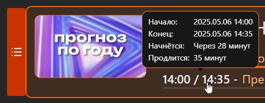
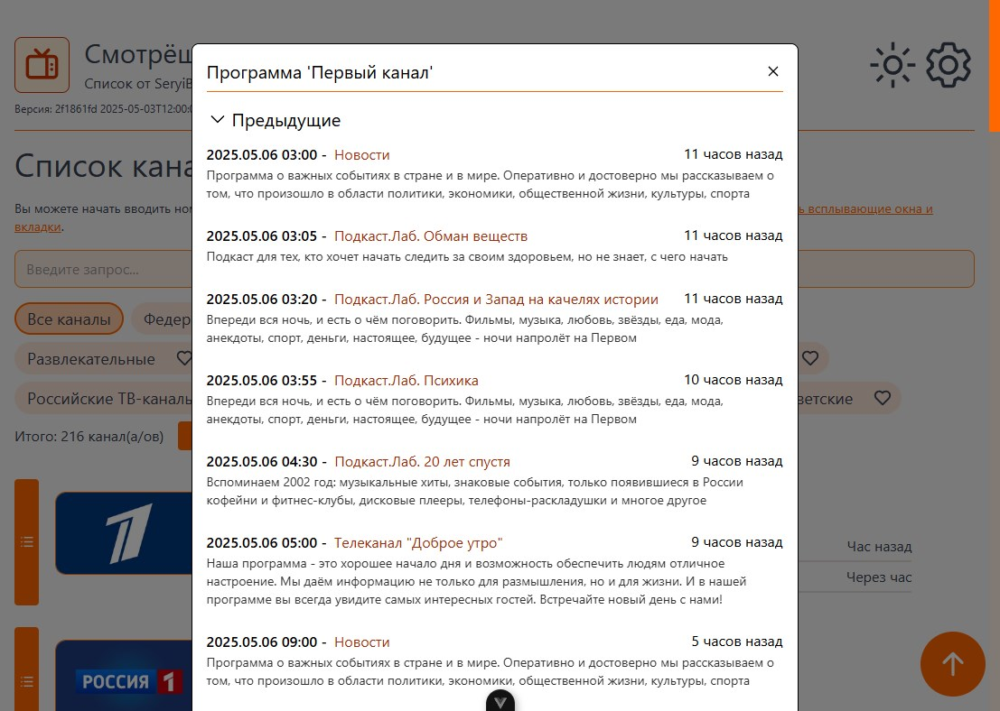
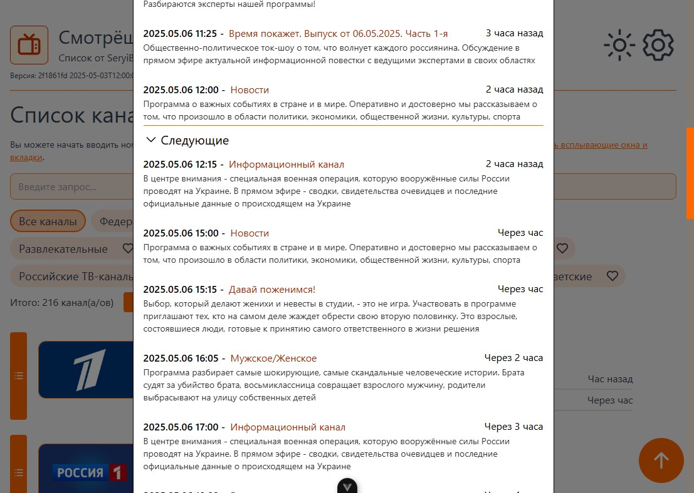
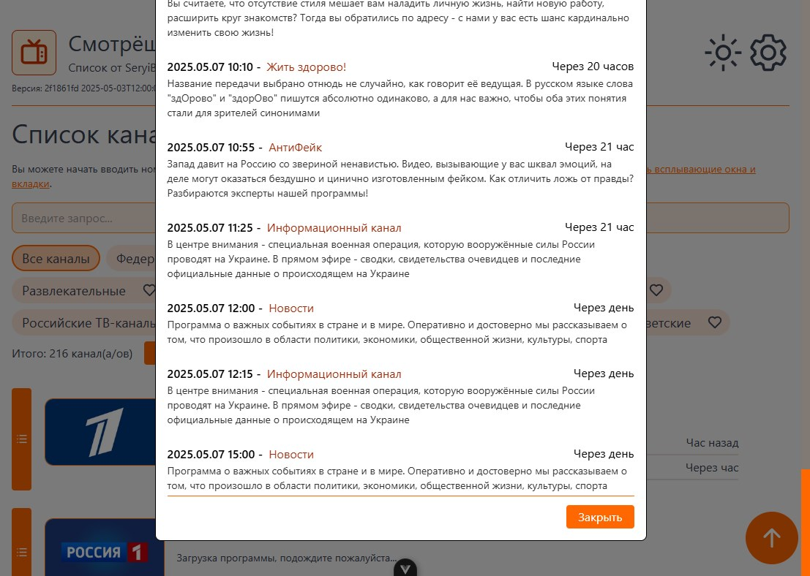

# smotreshka_list

Список каналов для Смотрёшки.

Основано на [vitesse-lite](https://github.com/antfu/vitesse-lite)

## [Открыть](https://seryibaran.github.io/smotreshka_list)

## Фичи

- 🔍️ Fuzzy-Поиск по номеру и названию канала ([2 скриншот выше](./readme_assets/2.jpg))
- 🎨 Кастомизация ([скриншот](./readme_assets/2.jpg), [скриншот настроек](./readme_assets/4.png))
- ✨ Набор номера с клавиатуры ([скриншот](./readme_assets/3.jpg))
- ✨ Удобный просмотр программ ([скриншот 1](./readme_assets/5.jpg), [скриншот 2](./readme_assets/6.jpg), [скриншот 3](./readme_assets/7.jpg), [скриншот 4](./readme_assets/8.jpg), [скриншот 5](./readme_assets/9.jpg))

## Скриншоты

